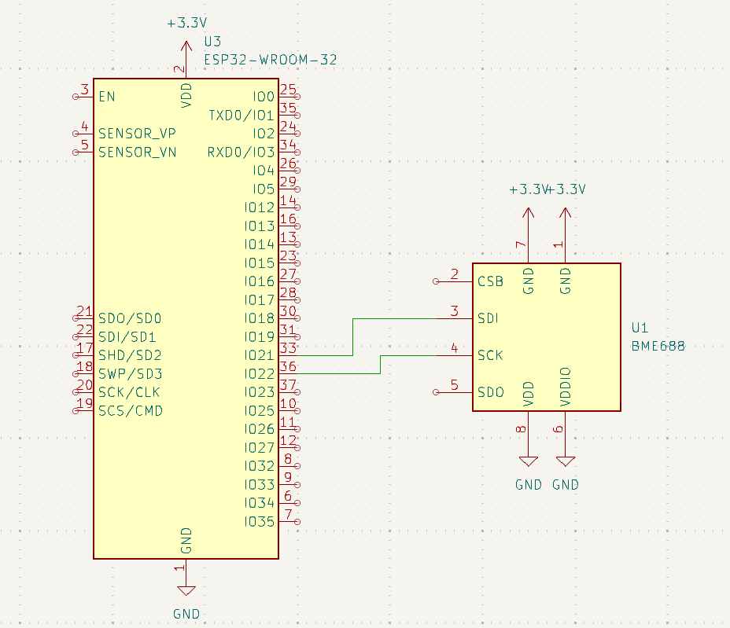
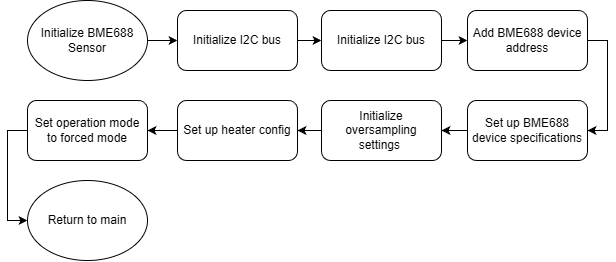
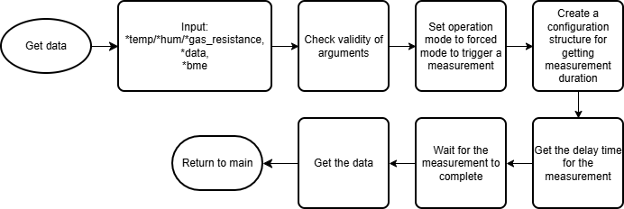

# BerryWeather - BME 688 Sensor
The BME 688 sensor is an integrated sensor [from Bosch Sensortec](https://www.bosch-sensortec.com/products/environmental-sensors/gas-sensors/bme688/) that reads the temperature, humidity, barometric pressure, and VOC gas sensing data from the atmosphere. 

For the purpose of the BerryWeather Project, the sensor is responsible for capturing the **temperature**, **humidity**, and **barometric pressure**.

## Implementation
To establish communication between the BME 688 sensor and the ESP32, we utilized the **I2C protocol**. Then, to read the data from the sensor, we utilized the [BME68X Sensor API](https://github.com/boschsensortec/BME68x_SensorAPI/tree/master) developed by Bosch Sensortec.
### Connections:
> _**Note**_: In order to connect the sensor with the ESP32 Microcontroller, a [board with built in connection ports](https://www.amazon.com/Environmental-Temperature-Barometric-Detection-Raspberry/dp/B0BZ4WV4PQ?th=1) was purchased.

To establish the I2C connection, the SDA and SCL pin on the BME688 board was connected to GPIO 21 and GPIO 22 respectively.

### Code:
To initialize and retrieve data from the sensor, an initialization function and three separate reading functions were written and utilized. The flow of each function can be observed in the following: 
> Flow diagram for bme688_init

> Flow diagram for bme688_read_x

## Results
Through some testing, it can be proven that the sensor provides a reasonably accurate data on atmospheric conditions. The data collected in a controlled environment (indoors) had little variation; and with a drastic change environment(indoors->outdoors), the measured data would become accurate within 1-2 minutes.